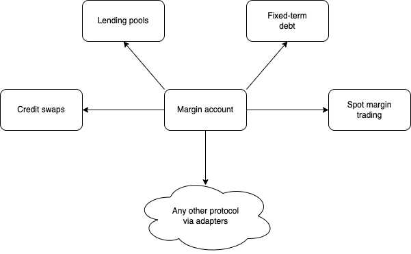

# ✈ Protocol

Jet Protocol is best conceived of as a constellation of products and services centred around the margin program.

Some products are Jet-native, designed and built by yours truly:

* The margin pools are traditional DeFi lending pools, engineered to lean on the margin accounts for collateral management.
* Fixed-term debt markets will revolutionise the way we lend and borrow on chain.

Other products are supported by connecting external protocols to the margin program:

* Spot margin trading is provided by adapters to trading venues including Orca and Serum.

User positions are margined across all assets, products, and protocol supported by the margin program.

In the following sections we describe how margin accounting works on Jet Protocol and the products that it supports.

Our technical documentation will be evolving with the code over the coming months. If you have specific questions left unanswered here please reach out to us at hello\[at]jetprotocol\[dot]io.&#x20;
