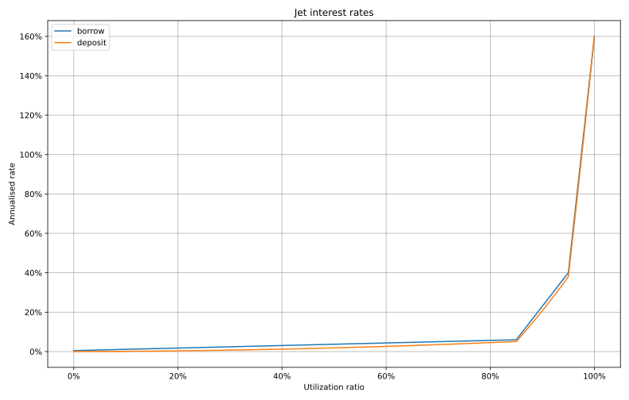

# 🛫 Interest Rates on Jet

**Utilization Ratio Determines Interest Rates**

The interest rates for each asset is dynamic (always changing) and determined as a function of the **utilization ratio** of each asset. For example, if 1000 USDC total has been supplied to the platform and 500 USDC is currently being borrowed, the utilization ratio for USDC at that moment would be 50%.

As the utilization ratio increases, the interest rate also increases. The interest rate curve on JET was designed with three segments, in order to improve upon and and add flexibility to the two segment curve typically used in borrowing and lending apps.

<table><thead><tr><th>Parameters</th><th>Values</th><th data-hidden></th></tr></thead><tbody><tr><td>First optimal utilisation point</td><td>85%</td><td></td></tr><tr><td>Second optimal utilisation point</td><td>95%</td><td></td></tr><tr><td>Starting interest rate</td><td>0.5%</td><td></td></tr><tr><td>Interest rate at first optimal point</td><td>6%</td><td></td></tr><tr><td>Interest rate at second optimal point</td><td>40%</td><td></td></tr><tr><td>Maximum interest rate</td><td>160%</td><td></td></tr></tbody></table>

**Tighter Interest Rate Spreads - Jet's Competitive Advantage**

**T**he Jet interest rate curve was designed with competition from other Solana-based protocols in mind. The **interest rate spread** is the difference between the lending and borrowing rates for a single asset, at a particular point in time. For example, if at this moment the USDC borrow rate was 11% and the lending rate was 24%, the spread for the USDC interest rate at that time is 13%.

The Jet interest rate curve was designed to operate at a higher utilization ratio than the other protocols. As a result, Jet offers the tightest interest rate spreads.

**On average, the platform with tighter spreads offers better lending and borrowing rates. This is what Jet wants to provide -- All users of the protocol are at their happiest with the tightest spreads, since the borrowers are paying less in interest, and the lenders are receiving more!**

**How Jet Combats Liquidity Risk**

As the utilization ratio of an asset approaches 100%, **liquidity risk** increases, meaning that not all lenders will necessarily be able to withdraw fully at the same time (since at a high utilization, most of the deposited assets in that pool have been lent out and are under the control of the borrowers). Note that this issue is not unique to Jet and that it is common to all crypto applications that use the pooled lending model (such as AAVE and Compound on Ethereum, or Solend and Port Finance on Solana).&#x20;

To combat liquidity risk, Jet added a third segment to the interest rate curve. This third segment steepens dramatically at high utilization rates, enticing savvy lenders to deposit on the platform quickly and take advantage of the high interest rates paid (and thus combatting liquidity risk).
