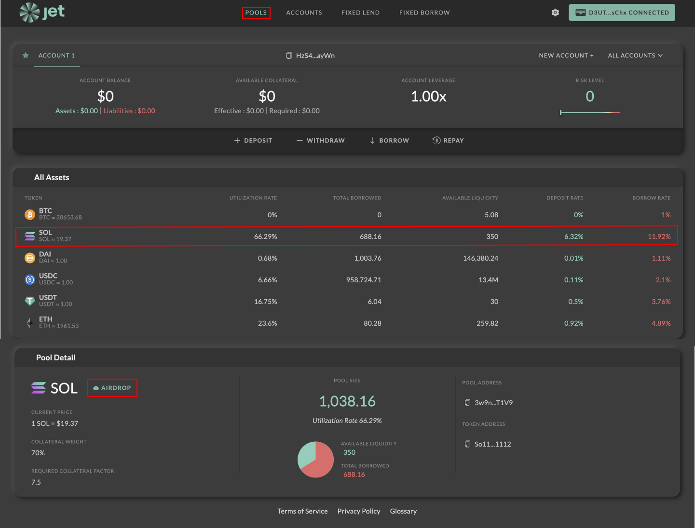

# How to Airdrop SOL and USDC to Test the Application

**Airdrop Devnet SOL to use to**&#x20;

Navigate to the “pools” section of the application. If not, just click “pools” on the top menu bar.&#x20;

Select “SOL” in the list of assets, as highlighted.&#x20;

Then, click the “airdrop” button to airdrop yourself some fuel to your devnet wallet.

<figure><figcaption>
"Airdrop" button
</figcaption></figure>

**Airdrop Devnet USDC to use for transactions**

Next, airdrop yourself some USDC in the same manner – choose “USDC” under “All Assets” and click the “airdrop” button. You will receive 100,000 devnet USDC tokens, which we can use to simulate both lending and borrowing in the fixed term application.

The next step is to[ create a margin account and deposit some USDC or SOL to test with.](create-a-margin-account-and-deposit-usdc.md)

<figure><figcaption></figcaption></figure>
